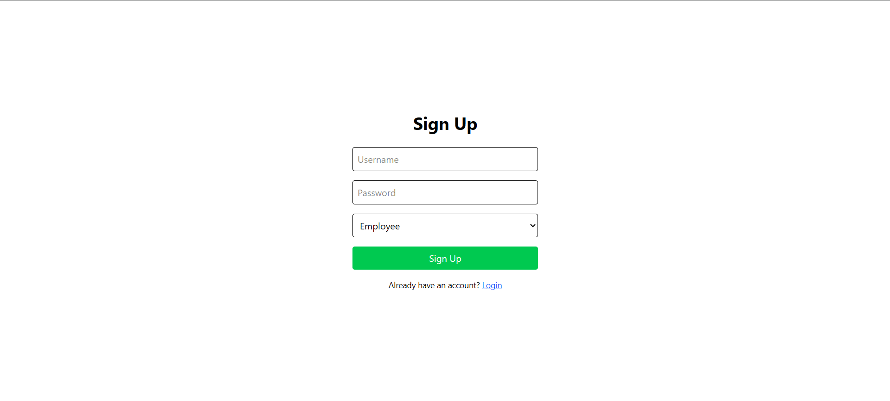
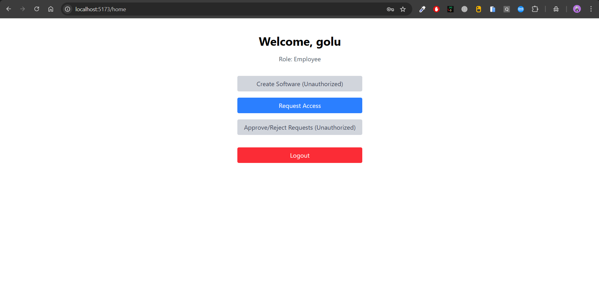
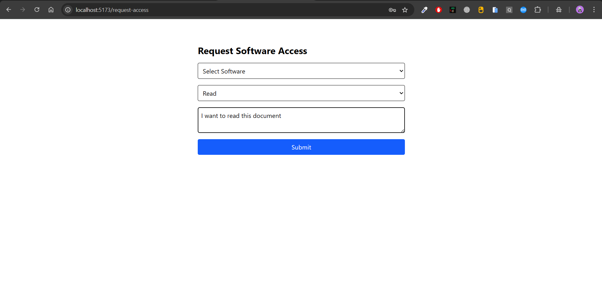
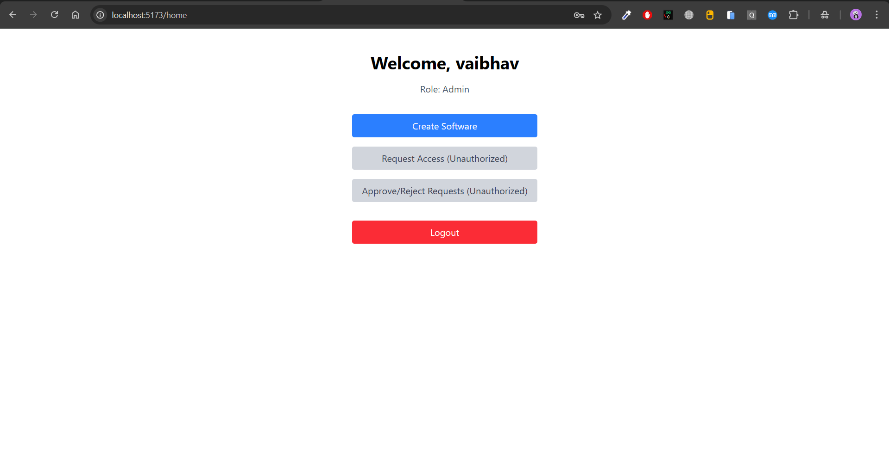
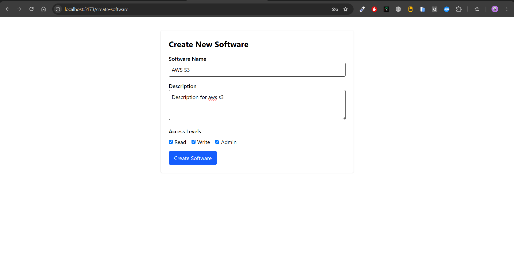
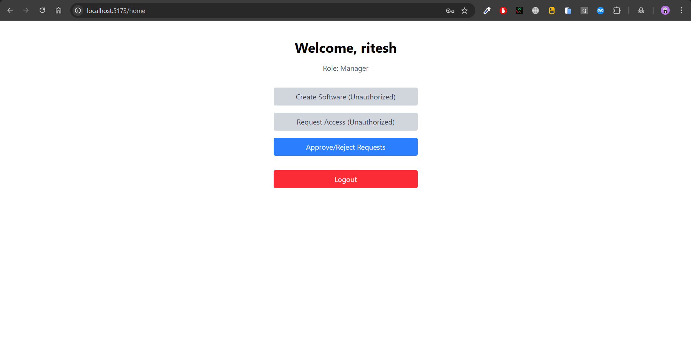
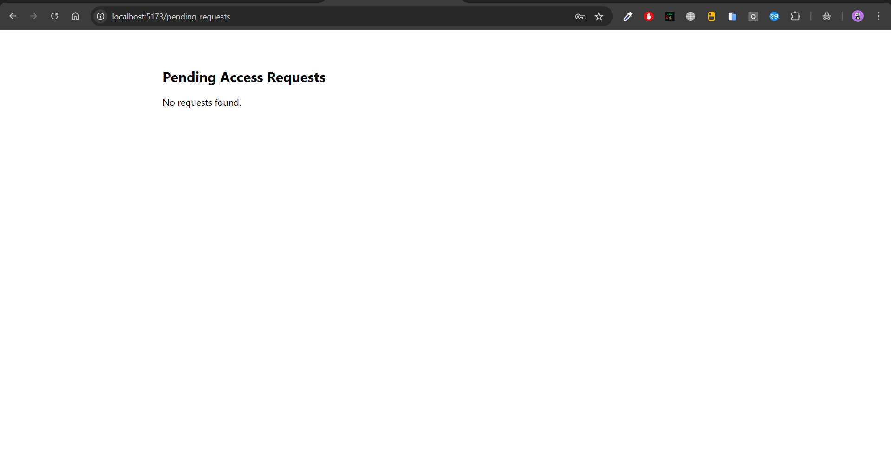

# 🖥️ User Access Management Frontend

This is the **Frontend** for the User Access Management System, built using **React.js** and **Tailwind CSS**. It allows users to sign up, log in, request software access, and for admins/managers to manage requests.

## Project Screenshots










## 🚀 Features

- 🔐 **Authentication (Login/Signup)**
- 🏠 **Role-based Dashboard**
- 🧑‍💻 **Create Software (Admin only)**
- 📥 **Request Software Access**
- ✅ **Approve/Reject Requests (Admin/Manager)**
- 🔄 **Global State with Context API**
- 🌐 **API Integration with Axios**
- 🎨 **Responsive UI with Tailwind CSS**
- 🧭 **Client-side Routing (React Router DOM)**

---

## 🛠️ Tech Stack

- **React.js**
- **Tailwind CSS**
- **React Router**
- **Axios**
- **React Hot Toast**
- **Context API**

---

## 📁 Project Structure

# 🖥️ Software Access Management Frontend

This is the **Frontend** for the Software Access Management System, built using **React.js** and **Tailwind CSS**. It allows users to sign up, log in, request software access, and for admins/managers to manage requests.

## 🚀 Features

- 🔐 **Authentication (Login/Signup)**
- 🏠 **Role-based Dashboard**
- 🧑‍💻 **Create Software (Admin only)**
- 📥 **Request Software Access**
- ✅ **Approve/Reject Requests (Admin/Manager)**
- 🔄 **Global State with Context API**
- 🌐 **API Integration with Axios**
- 🎨 **Responsive UI with Tailwind CSS**
- 🧭 **Client-side Routing (React Router DOM)**

---

## 🛠️ Tech Stack

- **React.js**
- **Tailwind CSS**
- **React Router**
- **Axios**
- **React Hot Toast**
- **Context API**

---

## 📁 Project Structure

# 🖥️ Software Access Management Frontend

This is the **Frontend** for the Software Access Management System, built using **React.js** and **Tailwind CSS**. It allows users to sign up, log in, request software access, and for admins/managers to manage requests.

## 🚀 Features

- 🔐 **Authentication (Login/Signup)**
- 🏠 **Role-based Dashboard**
- 🧑‍💻 **Create Software (Admin only)**
- 📥 **Request Software Access**
- ✅ **Approve/Reject Requests (Admin/Manager)**
- 🔄 **Global State with Context API**
- 🌐 **API Integration with Axios**
- 🎨 **Responsive UI with Tailwind CSS**
- 🧭 **Client-side Routing (React Router DOM)**

---

## 🛠️ Tech Stack

- **React.js**
- **Tailwind CSS**
- **React Router**
- **Axios**
- **React Hot Toast**
- **Context API**

---

## 📁 Project Structure

src/
├── api/ # Axios instance setup
├── assets/ # Images & icons
├── components/ # Reusable UI components
├── context/ # Auth Context (Global State)
├── pages/ # All routes/pages (Login, Signup, Home, etc.)
├── utils/ # Utility functions like role-based redirects
├── App.jsx # Main component with Routes
└── main.jsx # Entry point

---

## 📦 Setup Instructions

### 1. Clone the repository

```bash
git clone https://github.com/vaibhav-chittora/User-Access-Management-System-Frontend.git

cd user-access-frontend
```

### 2. Install dependencies

`npm install`

### 3. Set backend API URL (if needed)

Update axiosInstance.js to match your backend URL:

```bash
 const axiosInstance = axios.create({
  baseURL: "http://localhost:3000/api/v1", // Update with your backend URL
});

```

### 4. Run the app

`npm start`

Open your browser at `http://localhost:5173`

## 👥 Role Based Access Control

| **Role**    | **Can Create Software** | **Can Request Access** | **Can Approve Requests** |
| ----------- | ----------------------- | ---------------------- | ------------------------ |
| **Admin**   | ✅ Yes                  | ✅ Yes                 | ✅ Yes                   |
| **Manager** | ❌ No                   | ✅ Yes                 | ✅ Yes                   |
| **User**    | ❌ No                   | ✅ Yes                 | ❌ No                    |
